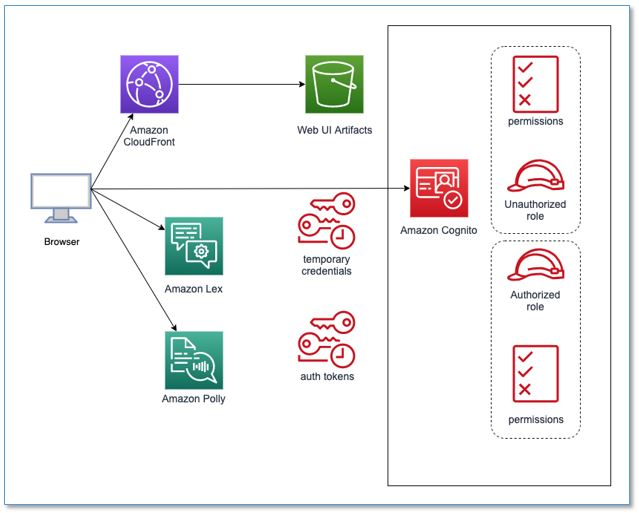

# FTF_investment_bot

### A Chatbot for 401k investment powered by Amazon Lex &amp; AWS Lambda

---

Our Chatbot FTF_Bot (For The Future) was integrated into a Web UI that we have deployed in AWS using CloudFormation. Below is a simple architecture of the deployment:

The [CloudFormation stack (source code ref)](https://github.com/aws-samples/aws-lex-web-ui/tree/master/templates) created the following resources:

- [Cognito Identity Pool](http://docs.aws.amazon.com/cognito/latest/developerguide/identity-pools.html)
used to pass temporary AWS credentials to the web app. Users can create accounts that will save their chatbot experience
- [CodeBuild](https://aws.amazon.com/codebuild/) project to configure
and deploy to S3 when using the CodeBuild Deployment Mode.
- [S3](https://aws.amazon.com/s3/) buckets to host the web application
and to store build artifacts.
- [Lambda](https://aws.amazon.com/lambda/) functions used as CloudFormation
[Custom Resources](http://docs.aws.amazon.com/AWSCloudFormation/latest/UserGuide/template-custom-resources.html)
to facilitate custom provisioning logic
- [CloudWatch Logs](http://docs.aws.amazon.com/AmazonCloudWatch/latest/logs/WhatIsCloudWatchLogs.html)
groups automatically created to log the output of the Lambda functions
- Associated [IAM roles](http://docs.aws.amazon.com/IAM/latest/UserGuide/id_roles.html)
for the stack resources

[Here](https://d2zecd7p5lmd.cloudfront.net/) is demo WebUI that you can test and interact with our Chatbot. 