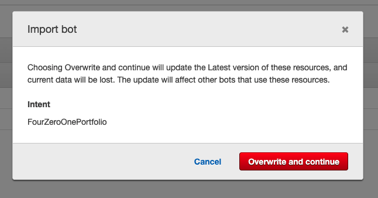

# FTF_investment_bot

## A Chatbot for 401k investment powered by Amazon Lex &amp; AWS Lambda

Our mission was to create a bot that allows our user to create and manage their investments in their 401k and 529 plan. Our project is targeted towards young professionals just starting out and/or thinking about pursuing higher education. 

---

## Technologies

The Lamda function includes the following libraries:

* [relativedelta](https://dateutil.readthedocs.io/en/stable/relativedelta.html) - Used for interval dates and times.

* [datetime](https://www.programiz.com/python-programming/datetime) - Used to work with dates and times


The application depends on Lamda function to work: 

Some of the code is listed below:

```python
return intent_request["currentIntent"]["slots"]
```
```python
return {
        "sessionAttributes": session_attributes,
        "dialogAction": {
            "type": "ElicitSlot",
            "intentName": intent_name,
            "slots": slots,
            "slotToElicit": slot_to_elicit,
            "message": message,
        },
    }


def delegate(session_attributes, slots):
```
---

## Installation Guide

1. Open Gitbash or terminal and go in to the folder where you want to place the files.
2. Click on the green "code" button which will allow you to clone.
3. Then click on SSH or HTTPS as a clone method depending on if you have the SSH key setup. You will copy the link. You will then type "git clone" in Gitback or Terminal. Then paste the ssh or https information and press enter.
4. Next type "git pull" command in Terminal or GitBash to pull the repository from the remote Github repository to a local directory on your computer.
5. You have access to the project. Also there will be all the files that the application is depended on. 

---
## Usage


### A Chatbot for 401k investment powered by Amazon Lex &amp; AWS Lambda

Below the steps for Lamda function:

1. Used conditional statement to sort by the age of the user.
2. The bot asks a question about risk tolerance.
3. Then it sorts by income frequency (weekly, bi-weekly, monthly).
4. The codes sorts the risk tolerance that the user has selected.
5. Bot then calculates the future savings with the best fund tailored to the person going by their age and risk tolerance. 


Our Chatbot FTF_Bot (For The Future) was integrated into a Web UI that we have deployed in AWS using CloudFormation. Below is a simple architecture of the deployment:


The [CloudFormation stack (source code ref)](https://github.com/aws-samples/aws-lex-web-ui/tree/master/templates) created the following resources:

- [Cognito Identity Pool](http://docs.aws.amazon.com/cognito/latest/developerguide/identity-pools.html)
used to pass temporary AWS credentials to the web app. Users can create accounts that will save their chatbot experience
- [CodeBuild](https://aws.amazon.com/codebuild/) project to configure
and deploy to S3 when using the CodeBuild Deployment Mode.
- [S3](https://aws.amazon.com/s3/) buckets to host the web application
and to store build artifacts.
- [Lambda](https://aws.amazon.com/lambda/) functions used as CloudFormation
[Custom Resources](http://docs.aws.amazon.com/AWSCloudFormation/latest/UserGuide/template-custom-resources.html)
to facilitate custom provisioning logic
- [CloudWatch Logs](http://docs.aws.amazon.com/AmazonCloudWatch/latest/logs/WhatIsCloudWatchLogs.html)
groups automatically created to log the output of the Lambda functions
- Associated [IAM roles](http://docs.aws.amazon.com/IAM/latest/UserGuide/id_roles.html)
for the stack resources

[Here](https://d2zecd7p5lmd.cloudfront.net/index.html) is demo WebUI that you can test and interact with our Chatbot. 

After running into a few issues with export/import the Lex Bot, we figured out by changing the ARN resource of the Lambda function (as it's coming from a different account). Here is an example of how the import looks:



---

## Contributors

This application is created for the purpose to complete a Project. 
By _Johann Maiga, Jonathan Bennett, Joshua James and Khatija Azeem_. 

---

## License

For this application, we used paid subscription to Amazon Lex, Lamda, and Cloudwatch. Once we post the assignment there will be no restriction on usage of this code.